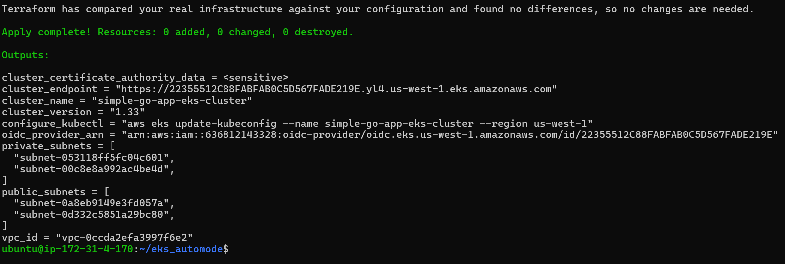
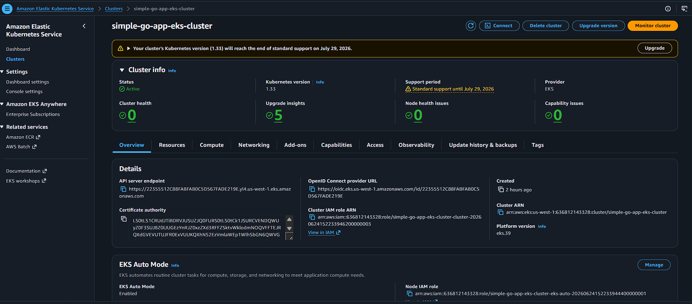
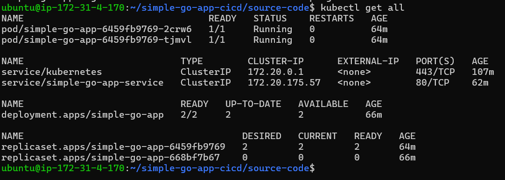
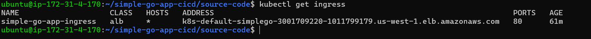
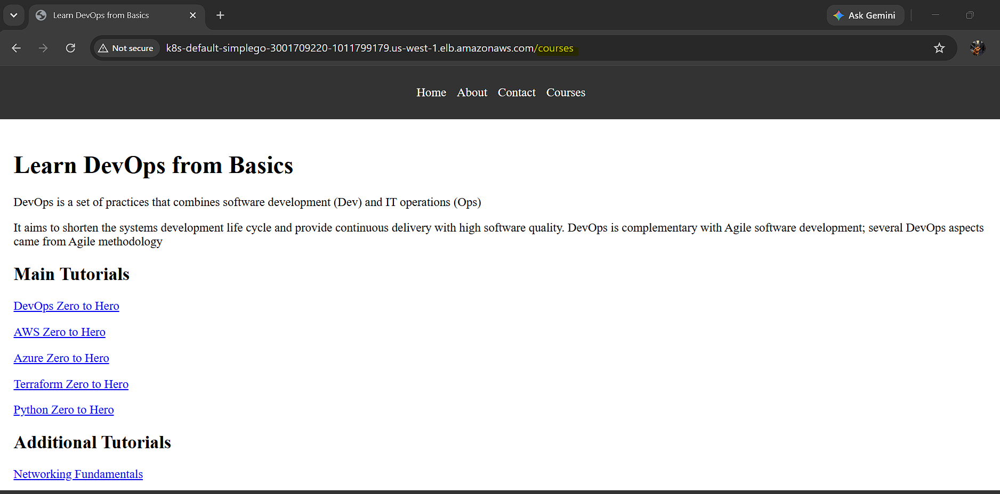

# 🚀 End-to-End Go Application Deployment on AWS EKS Auto Mode using Terraform, Kubernetes & GitHub Actions

A cloud-native DevOps project demonstrating how to provision infrastructure with Terraform, deploy a containerized Go application to Amazon EKS Auto Mode, expose it through AWS Application Load Balancer (ALB), and automate delivery using GitHub Actions.

---

## 📖 Project Overview

This project showcases a complete modern cloud-native deployment workflow:

* Infrastructure provisioning using Terraform
* Amazon EKS Auto Mode cluster deployment
* Containerized Go web application
* Multi-stage Docker builds
* Distroless runtime image for improved security
* Kubernetes Deployments, Services, and Ingress
* AWS Application Load Balancer integration
* GitHub Actions CI/CD automation

The goal of this project is to demonstrate Infrastructure as Code (IaC), containerization, Kubernetes orchestration, and automated application delivery on AWS.

---

## 🏗️ Architecture

```text
                 ┌─────────────────┐
                 │    Developer    │
                 └────────┬────────┘
                          │
                          ▼
                 ┌─────────────────┐
                 │     GitHub      │
                 │   Source Code   │
                 └────────┬────────┘
                          │
                          ▼
                 ┌─────────────────┐
                 │ GitHub Actions  │
                 │     CI/CD       │
                 └────────┬────────┘
                          │
                          ▼
                 ┌─────────────────┐
                 │ Docker Build    │
                 └────────┬────────┘
                          │
                          ▼
                 ┌─────────────────┐
                 │ Container Image │
                 └────────┬────────┘
                          │
                          ▼
                 ┌─────────────────┐
                 │ Terraform       │
                 │ Infrastructure  │
                 └────────┬────────┘
                          │
                          ▼
                 ┌─────────────────┐
                 │ Amazon EKS      │
                 │ Auto Mode       │
                 └────────┬────────┘
                          │
                          ▼
                 ┌─────────────────┐
                 │ Kubernetes      │
                 │ Deployment      │
                 │ Service         │
                 │ Ingress         │
                 └────────┬────────┘
                          │
                          ▼
                 ┌─────────────────┐
                 │ AWS ALB         │
                 └────────┬────────┘
                          │
                          ▼
                 ┌─────────────────┐
                 │ End Users       │
                 └─────────────────┘
```

---

## 🛠️ Technology Stack

| Technology           | Purpose                     |
| -------------------- | --------------------------- |
| Golang               | Application Development     |
| Docker               | Containerization            |
| Distroless           | Secure Runtime Image        |
| Terraform            | Infrastructure as Code      |
| Kubernetes           | Container Orchestration     |
| Amazon EKS Auto Mode | Managed Kubernetes Platform |
| AWS ALB              | External Traffic Routing    |
| GitHub Actions       | CI/CD Automation            |
| kubectl              | Kubernetes Management       |

---

## 📂 Repository Structure

```text
.
├── terraform/
│   └── eks_automode/
│
├── static/
│
├── deployment.yaml
├── service.yaml
├── ingress.yaml
│
├── Dockerfile
├── go.mod
├── go.sum
├── main.go
│
└── .github/
    └── workflows/
```

---

## 🏗️ Infrastructure Provisioning with Terraform

Infrastructure is provisioned using Terraform from:

```text
terraform/eks_automode
```

### Resources Provisioned

* Amazon EKS Auto Mode Cluster
* Networking Components
* IAM Roles and Permissions
* Security Groups
* Kubernetes Control Plane Components
* Load Balancer Integration

### Initialize Terraform

```bash
cd terraform/eks_automode

terraform init
```

### Validate Configuration

```bash
terraform validate
```

### Review Changes

```bash
terraform plan
```

### Create Infrastructure

```bash
terraform apply
```

Approve when prompted:

```text
yes
```

---

## ☸️ Configure kubectl

After Terraform successfully provisions the EKS cluster:

```bash
aws eks update-kubeconfig \
  --region <aws-region> \
  --name <cluster-name>
```

Verify connectivity:

```bash
kubectl get nodes
```

Expected output:

```text
NAME                                  STATUS   ROLES
ip-10-x-x-x.ec2.internal             Ready    <none>
```

---

## 🐳 Docker Implementation

This project uses a Multi-Stage Docker Build strategy.

### Build Stage

* Uses official Golang image
* Downloads dependencies
* Compiles application binary

### Runtime Stage

* Uses Distroless image
* Copies only required artifacts
* Reduces image size
* Improves security posture
* Minimizes attack surface

### Build Docker Image

```bash
docker build -t simple-go-app .
```

### Run Locally

```bash
docker run -p 8080:8080 simple-go-app
```

### Verify Application

```bash
curl http://localhost:8080
```

---

## 🚀 Deploy Application to Kubernetes

Deploy Kubernetes resources:

```bash
kubectl apply -f deployment.yaml
kubectl apply -f service.yaml
kubectl apply -f ingress.yaml
```

Verify deployment:

```bash
kubectl get deployments
kubectl get pods
kubectl get svc
kubectl get ingress
```

---

## 🌐 AWS Application Load Balancer (ALB)

The application is exposed using AWS Application Load Balancer through Kubernetes Ingress.

### Benefits

* Layer 7 Routing
* Automatic Target Registration
* Health Checks
* High Availability
* Native AWS Integration

Retrieve ALB endpoint:

```bash
kubectl get ingress
```

Example output:

```text
NAME            CLASS   HOSTS   ADDRESS
simple-go-app   alb     *       k8s-xxxxx.amazonaws.com
```

Open the generated DNS name in your browser.

---

## ⚙️ CI/CD Pipeline

GitHub Actions automates the application delivery workflow.

### Pipeline Responsibilities

* Source Code Checkout
* Application Build
* Docker Image Build
* Container Image Push
* Kubernetes Deployment Updates
* Automated Delivery to EKS

Pipeline execution is triggered whenever changes are pushed to the configured branch.

---

## 📸 Screenshots

### Terraform Apply

> Add screenshot below



---

### Amazon EKS Auto Mode Cluster

> Add screenshot below



---

### Kubernetes Resources

> Add screenshot below



---

### AWS Application Load Balancer

> Add screenshot below



---

### Application Homepage

> Add screenshot below



---

### GitHub Actions Pipeline

> Add screenshot below


---

## 🔍 Validation

Verify Pods:

```bash
kubectl get pods -o wide
```

Verify Services:

```bash
kubectl get svc
```

Verify Endpoints:

```bash
kubectl get endpoints
```

Verify Ingress:

```bash
kubectl get ingress
```

Describe Ingress:

```bash
kubectl describe ingress <ingress-name>
```

---

## 🧰 Troubleshooting

### Service Has No Endpoints

Verify Service selectors match Pod labels:

```bash
kubectl get endpoints
```

---

### Application Not Reachable

Verify container and service ports match:

```yaml
containerPort: 8080
targetPort: 8080
```

---

### ALB Returns 503

Possible causes:

* Unhealthy targets
* Incorrect service selector
* Incorrect target port
* Failed health checks
* Security group restrictions

---

### Ingress Not Created

Verify IngressClass:

```bash
kubectl get ingressclass
```

Check Ingress events:

```bash
kubectl describe ingress <ingress-name>
```

---

## 🔐 Security Best Practices

This project follows several container and deployment security practices:

* Infrastructure as Code
* Multi-stage Docker builds
* Distroless runtime image
* Reduced attack surface
* Minimal runtime dependencies
* Managed Kubernetes control plane

---

## 🎯 Learning Outcomes

This project demonstrates practical experience with:

* Infrastructure as Code (Terraform)
* Amazon EKS Auto Mode
* Kubernetes Deployments
* Kubernetes Networking
* AWS ALB Ingress
* Docker Image Optimization
* Container Security
* GitHub Actions CI/CD
* Cloud-Native Application Delivery

---

## 🧹 Cleanup

To avoid unnecessary AWS charges:

```bash
cd terraform/eks_automode

terraform destroy
```

Confirm:

```text
yes
```

This removes all infrastructure created by Terraform.

---

## 🚀 Future Enhancements

* Helm Charts
* ArgoCD GitOps Deployment
* Prometheus Monitoring
* Grafana Dashboards
* SSL/TLS Termination
* Blue/Green Deployments
* Canary Releases

---

## 👨‍💻 Author

**Yogesh Bharambe**

DevOps Engineer | AWS | Kubernetes | Terraform

GitHub: https://github.com/yogeshb01

---

## ⭐ Support

If you found this project useful, consider giving it a ⭐ on GitHub.
